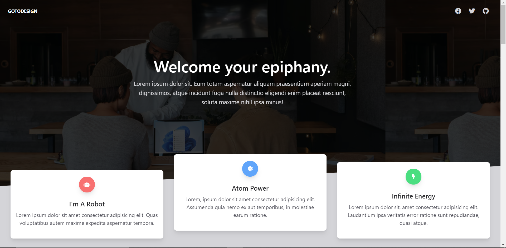

# animated_scrolling_template

## Description

This project uses an existing code base and modifies it. The template is updated with new images and a third party library is used to animate the template. The library that was used is called Animate On Scroll and it has been used to add animations to each section of the page.

## Demo

A demo of the proejct can be found here: https://tod619.github.io/animated_scrolling_template/
